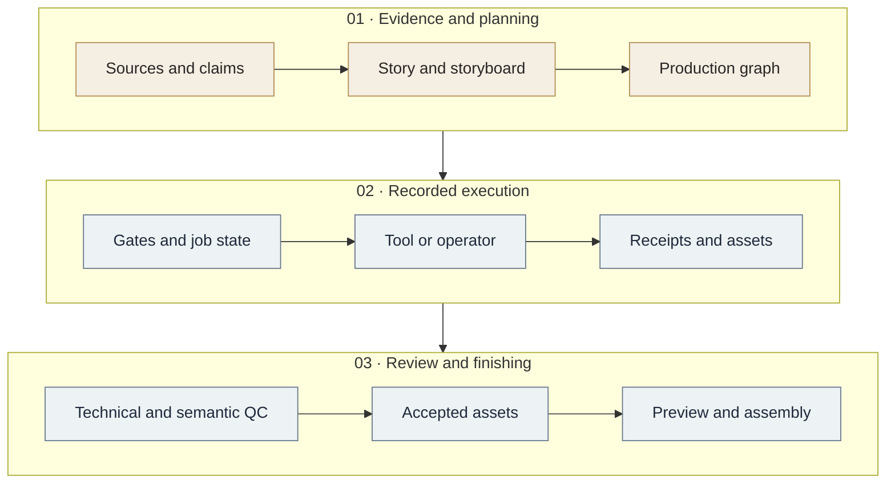

<p align="center">
  
</p>

<p align="center">
  <strong>An evidence-grounded Agent Skill and production runtime for historical short films.</strong>
</p>

<p align="center">
  <a href="https://github.com/Brighthao18/chronicle-frame/actions/workflows/ci.yml"></a>
  <a href="https://github.com/Brighthao18/chronicle-frame/releases"></a>
  <a href="pyproject.toml"></a>
  <a href="LICENSE"></a>
</p>

<p align="center">
  <a href="README.zh-CN.md">简体中文</a> ·
  <a href="#quick-start">Quick start</a> ·
  <a href="SKILL.md">Agent Skill</a> ·
  <a href="docs/releases/v3.3.0.md">Release notes</a> ·
  <a href="CONTRIBUTING.md">Contribute</a>
</p>

ChronicleFrame connects historical research to a repeatable film-production workflow.
An agent develops the story and reviews meaning; a local runtime tracks the production
graph, human decisions, external job receipts and accepted assets, then builds previews
and finishes media. Each claim has a source. Each accepted asset has a traceable record.

Use it for archival stories, museum films, institutional history and documentary
reconstruction. You can plan and render local media without a cloud-generation account.

## Why ChronicleFrame

| Production problem | What the project provides |
| --- | --- |
| A compelling reconstruction can be mistaken for evidence | Separate records for archival evidence, supported inference, restoration, reconstruction and generated media |
| A source or frame changes halfway through production | Hash-bound dependencies that mark downstream work stale |
| An external request times out with an uncertain result | Durable claims and receipts; ambiguous submissions remain active rather than being silently repeated |
| A technical check passes but the scene tells the wrong story | Separate technical QC, semantic review and human approval |
| A workflow assumes one provider or one historical project | Observed provider capabilities, optional JSON profiles and an offline core |

The project preserves the established `historical-shortfilm-director` Skill and Python
package names, and the `hsd` command. **ChronicleFrame** is the public repository name.

## Quick start

**Requirements:** Python 3.10+. The core uses the standard library. The media demo also
needs FFmpeg on your `PATH` and the optional media dependencies.

```sh
git clone https://github.com/Brighthao18/chronicle-frame.git historical-shortfilm-director
cd historical-shortfilm-director
python -m venv .venv
```

The clone directory matches the declared Skill name, as required by structural validation.
The public repository remains ChronicleFrame. Activate the environment:

| Shell | Command |
| --- | --- |
| PowerShell | `.venv\Scripts\Activate.ps1` |
| macOS / Linux | `source .venv/bin/activate` |

Then install and run the offline example:

```sh
python -m pip install -e ".[media]"
hsd doctor
python examples/minimal/create_demo.py work/demo
hsd validate work/demo
hsd prepare work/demo
hsd status work/demo
hsd next work/demo
hsd qc work/demo
hsd animatic work/demo
hsd qc work/demo --media
```

**Result:** a three-second preview made from original geometric fixtures, an HTML
preview and a hash receipt in `work/demo/previews/`. The example has no historical
claims, makes no provider calls and leaves every human gate pending.
[See the example and its limitations.](examples/minimal/README.md)

For planning alone, install with `python -m pip install -e .`; no FFmpeg or provider
credentials are required. Install FFmpeg with your operating system's package manager.
`HSD_FFMPEG` or project `local.ffmpeg_path` can select an existing executable. An
already-installed `imageio-ffmpeg` remains an optional discovery fallback; the runtime
does not install it or download FFmpeg automatically.

Prebuilt wheels are available in [GitHub Releases](https://github.com/Brighthao18/chronicle-frame/releases).
This project is not published to PyPI. A wheel contains the Python runtime; the source
bundle also contains the Skill, documentation and examples.

## From evidence to an accepted film



Start a real project:

```sh
hsd init --title "Archive threshold" --profile generic --dir work/film
```

1. Inventory sources and rights; record claims and permitted wording in the evidence ledger.
2. Develop the story and populate `03_production_graph.json`.
3. Validate, prepare and inspect the work with `hsd status` and `hsd next`.
4. Record actual human decisions against reviewed artifacts and their hashes.
5. Execute ready jobs through an available tool or operator; ingest and review the outputs.
6. Build the preview, accept the picture edit and finish locally.

Human decisions concentrate on **story**, **representative visuals**, **exceptional
motion** and **picture lock**. A passing media test cannot approve any of them.

### Local CLI

| Command | Purpose |
| --- | --- |
| `hsd init` | Create a generic or profile-based project |
| `hsd validate` | Validate the production graph or Skill structure |
| `hsd prepare` | Compile local plans and job queues |
| `hsd status` / `hsd next` | Inspect state and eligible work |
| `hsd runtime` | Claim jobs and record receipts, ingestion, review and acceptance |
| `hsd qc` | Check graph/profile/file integrity; add `--media` for media checks |
| `hsd animatic` | Build a still-based preview |
| `hsd assemble` | Prepare assembly; add `--execute` to encode |
| `hsd migrate` | Preview a retained schema migration; add `--apply` to change it |
| `hsd doctor` | Inspect local runtime and media prerequisites |

Use `hsd --help` or `hsd <command> --help` for arguments. `hsd qc <project> --readiness`
audits broader planning: warnings return 1, errors return 2.

External execution remains a distinct step:

```text
claim → real external operation → receipt → ingest → review → accept
```

The CLI records this lifecycle; it does not generate images or control a browser.
See [the execution protocol](references/EXECUTION_PROTOCOL.md) for command forms and
JSON contracts. For accepted clips, compile the assembly manifest with
`python scripts/compile_direct_assembly.py <project>` before assembly. Subtitle and
final audio-mix entry points remain available through the compatibility scripts;
final mixing requires actual picture-lock approval. [Local finishing guide](references/LOCAL_FINISHING.md).

## Install as an Agent Skill

Place the complete source repository in your agent's supported Skills directory,
with the folder name **`historical-shortfilm-director`**, matching `SKILL.md`.
Keep `SKILL.md`, `references`, `scripts`, `src`, `VERSION` and package configuration
together. Install the runtime in an isolated environment and expose its `hsd` command
to the agent.

The Skill routes research, scripts, prompts, critique and production according to the
request. Detailed instructions load only when relevant.
[Agent Skills specification](https://agentskills.io/specification).

## Providers and profiles

Providers describe **observed capabilities**: first-frame or first/last-frame
conditioning, reference assets, extension, video editing, durations and verified
reference limits. Snapshots include a timestamp and evidence. Missing or stale
capabilities block dispatch while local preparation remains available.

Google Flow retains a browser/operator workflow; OpenAI image tools retain an
agent-tool workflow. There are no invented direct APIs, stored credentials or fixed
model-name assumptions. Legacy `IMG25_` / `FLOW_` identifiers remain compatibility
aliases. Generic projects use neutral routes and `image` / `video` capability slots.
[Provider model](references/PROVIDER_MODEL.md).

Project-specific policy lives in JSON profiles. The optional
[JNU gate example](examples/jnu-gate/README.md) demonstrates an advanced historical
profile; it is not a framework default. Original copyrighted historical media and
submission logistics are not bundled.

## Historical integrity

**Generated media never becomes historical evidence.** Preserve originals and source
provenance; label inference, restoration and reconstruction; record changes and allowed
narration. Historical claims and redistribution rights need source-specific review.
The code's MIT license does not grant rights to third-party archive images, faces or voices.

[Evidence policy](references/HISTORICAL_EVIDENCE.md) ·
[Design provenance](references/SOURCES.md) ·
[Historical-integrity issue](https://github.com/Brighthao18/chronicle-frame/issues/new?template=historical_integrity.yml)

## Development and validation

```sh
python -m pip install -e ".[dev]"
python -m compileall -q src scripts tools tests
hsd validate --skill .
python -m pytest
python -m ruff check .
python -m ruff format --check .
```

The local release validation passed **54 fast tests**, **6 real-media tests** and
the retained **41-method legacy self-test suite**. The replacement suite maps all
41 original methods to 35 fast and 6 media tests; the fast suite also tests the new
public interface. These counts overlap rather than representing 101 distinct behaviors.
[Coverage map](docs/test-coverage-mapping.json) · [Migration report](docs/MIGRATION_REPORT.md).

The public [Windows/Ubuntu Python matrix and wheel checks](https://github.com/Brighthao18/chronicle-frame/actions/runs/37298784798)
and [offline media workflow](https://github.com/Brighthao18/chronicle-frame/actions/runs/37298788454)
also passed. [Publication validation](docs/PUBLICATION_REPORT.md) records their scope.

Default tests and CI exclude slow media and live providers. Install media extras
and FFmpeg, then run `python -m pytest -m slow` for real local encoding. A separate
manual workflow runs this layer. No live-provider tests are implemented or claimed
as run; future live tests must use `live` and explicit `--live`, and disclose paid credits.

## Contribute and roadmap

Start with [CONTRIBUTING.md](CONTRIBUTING.md). Useful contributions include synthetic
profiles, observed capability support, reproducible runtime fixes and evidence-led
historical corrections. Preserve authored plans, accepted asset hashes and active requests.
Read [SECURITY.md](SECURITY.md) before reporting vulnerabilities and
[CODE_OF_CONDUCT.md](CODE_OF_CONDUCT.md) before participating.

Next: explicit migration of remaining legacy wire names, more synthetic examples,
and opt-in provider adapters backed by real observed capabilities. Real production
and creative quality require separate validation.

## License and release

[MIT](LICENSE). **v3.3.0** is the first public ChronicleFrame release, preserving the
internal v3.2.1 production baseline. Package imports, Skill name, legacy scripts and
wire-format aliases remain compatible. [Changelog](CHANGELOG.md) ·
[Release notes](docs/releases/v3.3.0.md).
