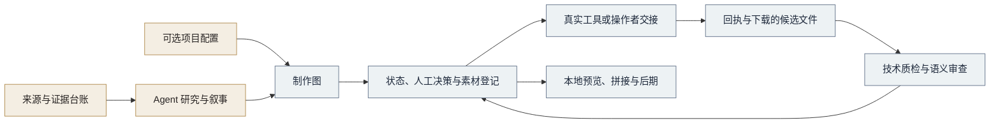

<p align="center">
  
</p>

<p align="center">
  <strong>一个以史料为依据的历史短片 Agent Skill 与制作运行工具。</strong>
</p>

<p align="center">
  <a href="https://github.com/Brighthao18/chronicle-frame/actions/workflows/ci.yml"></a>
  <a href="https://github.com/Brighthao18/chronicle-frame/releases"></a>
  <a href="pyproject.toml"></a>
  <a href="LICENSE"></a>
</p>

<p align="center">
  <a href="README.md">English</a> ·
  <a href="#快速开始">快速开始</a> ·
  <a href="SKILL.md">Agent Skill</a> ·
  <a href="docs/releases/v3.3.0.md">版本说明</a> ·
  <a href="CONTRIBUTING.md">参与贡献</a>
</p>

ChronicleFrame 把历史研究与可复查的短片制作流程连接起来。Agent 负责叙事和语义审查，
本地工具管理制作图、人工决策、外部任务回执和已接受素材，再完成预览与后期。
每项历史主张都有来源，每份已接受素材都有记录。

适用于档案故事、博物馆短片、校史与机构史、历史重建和纪实创作。
没有云端生成账号，也能进行本地规划和媒体制作。

## 它解决什么问题

| 制作中的问题 | ChronicleFrame 的处理方式 |
| --- | --- |
| 生成画面容易被误当成历史证据 | 分别记录档案证据、有依据的推断、修复、重建与生成媒体 |
| 制作中途修改来源或关键帧 | 用哈希绑定依赖，使受影响的下游结果过期 |
| 外部生成请求超时，结果不明确 | 保留有效任务与回执，不自动重复状态不明的请求 |
| 文件通过技术检查，却表达了错误的史实 | 分开进行技术质检、语义审查和人工批准 |
| 流程依赖某家供应商或某个历史项目 | 使用实测能力快照、可选 JSON 项目配置和离线核心 |

公开仓库名称为 **ChronicleFrame**。既有 Skill、Python 包和兼容入口仍使用
`historical-shortfilm-director`，命令仍为 `hsd`。

## 快速开始

**环境要求：** Python 3.10 及以上。核心功能只依赖标准库；媒体示例还需要安装 FFmpeg，
并使其位于 `PATH`，再安装可选媒体依赖。

```sh
git clone https://github.com/Brighthao18/chronicle-frame.git
cd chronicle-frame
python -m venv .venv
```

激活环境：

| 终端 | 命令 |
| --- | --- |
| PowerShell | `.venv\Scripts\Activate.ps1` |
| macOS / Linux | `source .venv/bin/activate` |

安装并运行离线示例：

```sh
python -m pip install -e ".[media]"
hsd doctor
python examples/minimal/create_demo.py work/demo
hsd validate work/demo
hsd prepare work/demo
hsd status work/demo
hsd next work/demo
hsd qc work/demo
hsd animatic work/demo
hsd qc work/demo --media
```

**得到什么：** 由原创几何图形生成的三秒动态分镜、HTML 预览和哈希回执，位于
`work/demo/previews/`。示例没有历史主张、不调用云端供应商，所有人工决策保持待定。
详见[示例说明与限制](examples/minimal/README.md)。

只做规划时安装 `python -m pip install -e .`，无需 FFmpeg 或供应商凭据。
FFmpeg 使用系统包管理器安装；也可通过 `HSD_FFMPEG` 或项目 `local.ffmpeg_path`
指定现有程序。保留已安装 `imageio-ffmpeg` 的可选发现机制，不会自动安装它或下载 FFmpeg。

[GitHub Releases](https://github.com/Brighthao18/chronicle-frame/releases) 提供安装包。
尚未发布到 PyPI。wheel 只包含 Python 运行包，完整源码还包含 Skill、文档和示例。

## 从证据到已接受影片



建立真实项目：

```sh
hsd init --title "档案中的门槛" --profile generic --dir work/film
```

1. 清点来源与权利，在证据台账中记录历史主张和允许措辞。
2. 发展故事，填写 `03_production_graph.json`。
3. 校验并准备制作，通过 `hsd status` 和 `hsd next` 查看状态。
4. 将实际人工决策绑定到审阅文件和哈希。
5. 用真实工具或操作者执行就绪任务，下载、登记和审查结果。
6. 生成预览，接受画面剪辑，再完成本地后期。

人工决策集中在**故事、代表性视觉、例外运动和画面锁定**四个节点。
技术检查通过不能代替这些决定。

### 本地命令

| 命令 | 用途 |
| --- | --- |
| `hsd init` | 创建通用项目或使用可选项目配置 |
| `hsd validate` | 校验制作图或 Skill 结构 |
| `hsd prepare` | 编译本地计划与任务队列 |
| `hsd status` / `hsd next` | 查看状态与可执行工作 |
| `hsd runtime` | 记录任务申请、回执、下载、审查与接受 |
| `hsd qc` | 检查结构和完整性；`--media` 加入媒体检查 |
| `hsd animatic` | 从静帧生成动态分镜预览 |
| `hsd assemble` | 准备拼接；`--execute` 执行编码 |
| `hsd migrate` | 预览旧格式迁移；`--apply` 实际修改 |
| `hsd doctor` | 检查本地环境与媒体前提 |

参数见 `hsd --help` 和 `hsd <命令> --help`。`hsd qc <项目> --readiness`
检查整体制作准备情况，警告返回 1，错误返回 2。

外部执行是独立步骤：

```text
申请任务 → 真实外部执行 → 回执 → 下载登记 → 审查 → 接受
```

命令行负责记录这些状态，本身不会生成图片或控制浏览器。具体命令和 JSON 合约见
[执行协议](references/EXECUTION_PROTOCOL.md)。已接受镜头先用
`python scripts/compile_direct_assembly.py <项目>` 编译拼接清单，再执行拼接。
兼容脚本保留字幕和最终音频混合功能；最终混音需要真实画面锁定批准。
详见[本地后期](references/LOCAL_FINISHING.md)。

## 作为 Agent Skill 安装

把完整源码仓库放入 Agent 支持的 Skills 目录，文件夹命名为
**`historical-shortfilm-director`**，与 `SKILL.md` 一致。保留主文件、`references`、
`scripts`、`src`、`VERSION` 和包配置，在隔离环境安装运行工具，并让 Agent 能使用 `hsd`。

Skill 根据请求处理研究、脚本、提示词、评论和制作，详细参考资料按需加载。
参见 [Agent Skills 标准](https://agentskills.io/specification)。

## 供应商与项目配置

供应商以**实际观察到的能力**描述：首帧或首尾帧约束、参考素材、延长、视频编辑、
可用时长和已核实参考数量。快照带时间与依据；缺失或过期时阻止派发，不影响本地准备。

Google Flow 保留浏览器或操作者交接方式，OpenAI 图像工具保留 Agent 工具交接方式。
没有虚构直接 API、内置凭据或固定模型名称假设。`IMG25_` / `FLOW_` 等旧标识继续作为
兼容格式；通用项目采用中性路线与 `image` / `video` 能力槽位。
详见[供应商模型](references/PROVIDER_MODEL.md)。

项目规则使用 JSON 配置。[JNU 校门示例](examples/jnu-gate/README.md) 演示可选高级配置，
不作为通用默认值；不包含原始受版权保护的历史素材或投稿安排。

## 历史完整性

**生成媒体永远不是历史证据。** 保留原件和来源，明确标注推断、修复与重建，记录修改
和允许旁白。历史主张和传播权利必须逐项审查。代码的 MIT 许可不授予第三方档案图片、
人物或声音的使用权。

[证据政策](references/HISTORICAL_EVIDENCE.md) ·
[设计来源](references/SOURCES.md) ·
[历史完整性问题](https://github.com/Brighthao18/chronicle-frame/issues/new?template=historical_integrity.yml)

## 开发与验证

```sh
python -m pip install -e ".[dev]"
python -m compileall -q src scripts tools tests
hsd validate --skill .
python -m pytest
python -m ruff check .
python -m ruff format --check .
```

本地发布验证通过 **54 项快速测试、6 项真实媒体测试**和保留的**原 41 项自测**。
新测试把原 41 项断言对应为 35 项快速测试和 6 项媒体测试，另覆盖新增公开接口；
这些数量存在重叠，不应相加当作 101 项独立行为。
[测试对应表](docs/test-coverage-mapping.json) · [迁移报告](docs/MIGRATION_REPORT.md)。

默认测试和 CI 不运行慢速媒体或在线供应商测试。安装媒体依赖和 FFmpeg 后，用
`python -m pytest -m slow` 检查真实本地编码；另有手动触发的媒体工作流。
目前没有已实现或宣称运行过的在线供应商测试。未来必须用 `live` 标记和 `--live`
显式启用，并说明可能消耗付费额度。

## 参与贡献与路线图

从 [CONTRIBUTING.md](CONTRIBUTING.md) 开始。欢迎合成项目配置、真实能力支持、可复现的
运行问题修复，以及带证据的历史纠正。保留手工编写的计划、已接受素材哈希与有效请求。
漏洞报告参见[安全说明](SECURITY.md)，参与交流请阅读[行为准则](CODE_OF_CONDUCT.md)。

后续计划包括明确迁移旧格式名称、增加合成示例，以及扩充基于实际观察的可选供应商
适配器。真实生产与创作质量需要另外验证。

## 许可与版本

许可为 [MIT](LICENSE)。**v3.3.0** 是 ChronicleFrame 的首个公开版本，保留内部 v3.2.1
制作基线。Python 导入、Skill 名称、旧脚本和兼容格式继续受支持。
[变更记录](CHANGELOG.md) · [版本说明](docs/releases/v3.3.0.md)。
